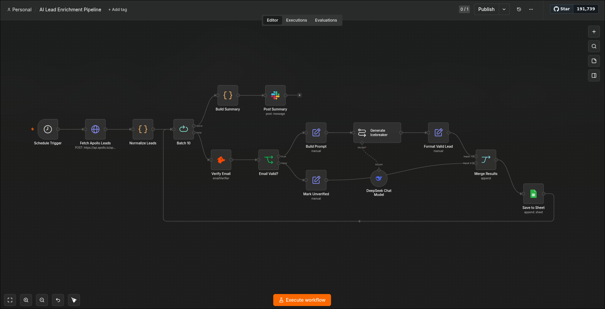

# AI Lead Enrichment Pipeline

## Demo Video

[](https://www.youtube.com/watch?v=VIDEO_ID)

---

## Workflow Overview



---

## What It Does

This workflow runs every morning at 9am and automatically enriches and verifies a list of
leads — without any manual input. It reads raw lead data from a Google Sheet, verifies each
email address with Hunter.io, uses an AI model (DeepSeek) to write a personalized icebreaker
opening line for each lead, then saves the enriched results back to a Google Sheet as a
ready-to-use lead list.

The entire process is batched so it handles large datasets without timing out or hitting API
limits in a single burst.

## Note on Lead Source (Apollo vs Sample Sheet)

The original design called for **Apollo.io** as the lead discovery source — it has a powerful
people search API that filters by job title, company size, industry, and more. However,
**Apollo's free plan does not include API access** to the people search endpoint. The UI allows
exports, but the API is paid-only.

For this demo the lead source is a **manually populated Google Sheet** (`Sample Leads` tab)
containing realistic lead data — names, titles, companies, industries, and emails. Two of the
entries use emails on domains with no valid mailboxes, demonstrating how the pipeline handles
undeliverable addresses gracefully without failing.

In a production setup with an Apollo paid plan, swapping in Apollo is a single node addition
at the front of the pipeline — the enrichment, verification, and AI logic downstream is
identical.

## Node-by-Node Flow

```
Schedule Trigger (9am daily)
  → Read Sample Leads (Google Sheets)  — reads raw leads from the "Sample Leads" tab
  → Batch 10                — processes leads in groups of 10
      [loop port] → Verify Email (Hunter.io)
                  → Email Valid?           — branches: valid emails vs. unverified
                      [true]  → Build Prompt       — constructs AI icebreaker prompt
                              → Generate Icebreaker (DeepSeek via chainLlm)
                              → Format Valid Lead  — maps all fields into sheet-ready structure
                      [false] → Mark Unverified    — flags lead as unverified, no icebreaker
                  → Merge Results          — combines both branches
                  → Save to Sheet          — appends enriched row to output sheet
                  → (loops back to Batch 10)
      [done port] → Build Summary          — counts enriched vs. skipped leads
                  → Post Slack Alert       — sends completion summary to Slack
```

## How It Fits Into the System

This workflow is **Stage 1** of the three-workflow sales pipeline:

1. **This workflow** — enriches and verifies leads, saves them to a Google Sheet
2. **Sheet → HubSpot + Instantly** — reads that same Google Sheet, creates HubSpot contacts,
   and enrolls each lead in an Instantly.ai outreach campaign
3. **Gmail Reply Classifier** — monitors the inbox for replies to those outreach emails
   and routes them back into HubSpot based on reply intent

Without this workflow running first, the Sheet → HubSpot workflow has no data to process.
The Google Sheet is the hand-off point between Stage 1 and Stage 2.

## Credentials Required

| Service | Credential Type | What It's Used For |
|---|---|---|
| Google Sheets | `googleSheetsOAuth2Api` | Reading the sample leads input + writing enriched output |
| Hunter.io | `hunterApi` | Verifying email deliverability |
| DeepSeek | `deepSeekApi` | Generating personalized icebreaker opening lines |
| Slack | `slackApi` | Posting the daily run summary |

**Difficulty to run without credentials:** Moderate. Google Sheets and Slack are straightforward
OAuth connections. Hunter.io free tier allows 25 verifications per month. DeepSeek requires an
API key. The sample sheet is included in this folder (`sample_leads.csv`) — import it into the
`Sample Leads` tab of your Google Sheet to run the demo without any external data source.

## Demo Notes

- The workflow is set to `active: false` — run manually via "Execute Workflow" in n8n
- Import `sample_leads.csv` into a tab named `Sample Leads` in the connected Google Sheet before running
- The output sheet populating in real time is the clearest visual — rows fill as the batch loop processes each lead
- Leads with undeliverable emails are saved with `email_status: unverified` and `icebreaker: SKIPPED`,
  showing the pipeline handles bad data gracefully rather than failing
- Slack alert at the end summarizes enriched vs. skipped counts
